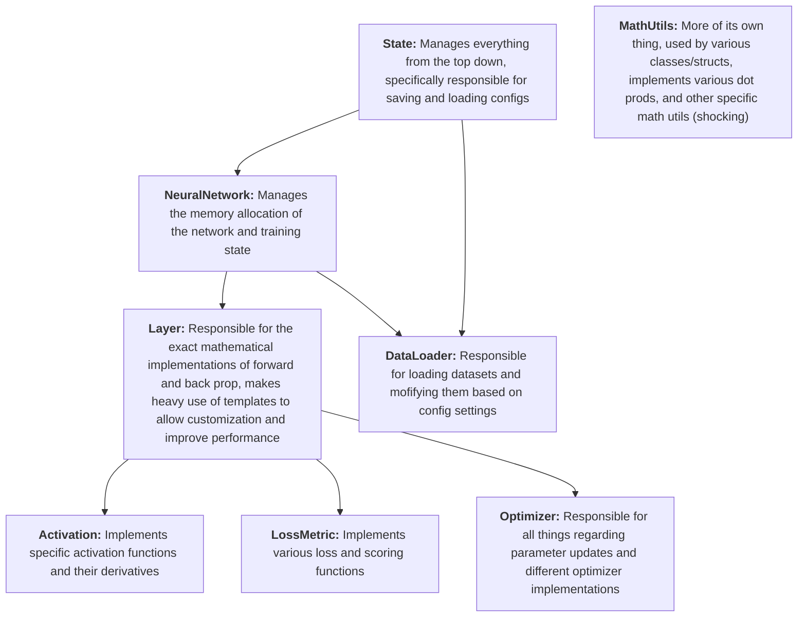

## MLEngine

MLEngine is a C++ command line tool for linux aimed to allow easy iteration on different neural network designs

#### In the works
* CNN

#### Future ideas
* GPU compatability
* Adding/Removing layers through iterations
* Custom language for the program
* User-defined datasets

### Install
To compile the project from source, simply download and extract the repo, then, in the project directory, run

```
bash build.sh
```

which will compile the program in release mode for you using CMake, I'd **strongly** reccommend using a GNU compiler, (g++ for unix, minGW for Windows)

### Description

Written from scratch in C++, MLEngine is a Machine Learning framework that allows a user to implement all sorts of machine learning concepts, currently does not support GPUs but bound to change one day. Highly optimized and customizable, a user can define what dataset to train on, the name of the model, model dimensions, activations, weight initilization, loss, scoring, and various other options that are used during training.
<br><br>
Much of the mathematical code has been lifted from a [previous project](https://github.com/Joey574/MachineLearningCpp) of mine, specifically, the core is very similair to the *SingleBlockNeuralNetwork* version, though many orginizational changes have been made. That proejct was much more focused on just getting the math right, it allowed me to form an understanding of how neural networks worked but was by no means easy to use. This project aims to change that, primarily by making it a command line tool and allowing easy iterations of different neural network designs.

### Use
All network architectures are passed to the program via a YAML configuration file, examples can be found in *Configs* and can be passed to the program like follows
```
MLEngine -c someconfig.yml
```
All specific YAML configurations and settings can be found in *DOCUMENTATION.md*

### How it works
MLEngine uses a general top down framework to allow vast customizability and modification while maintaining performance through use of templates



